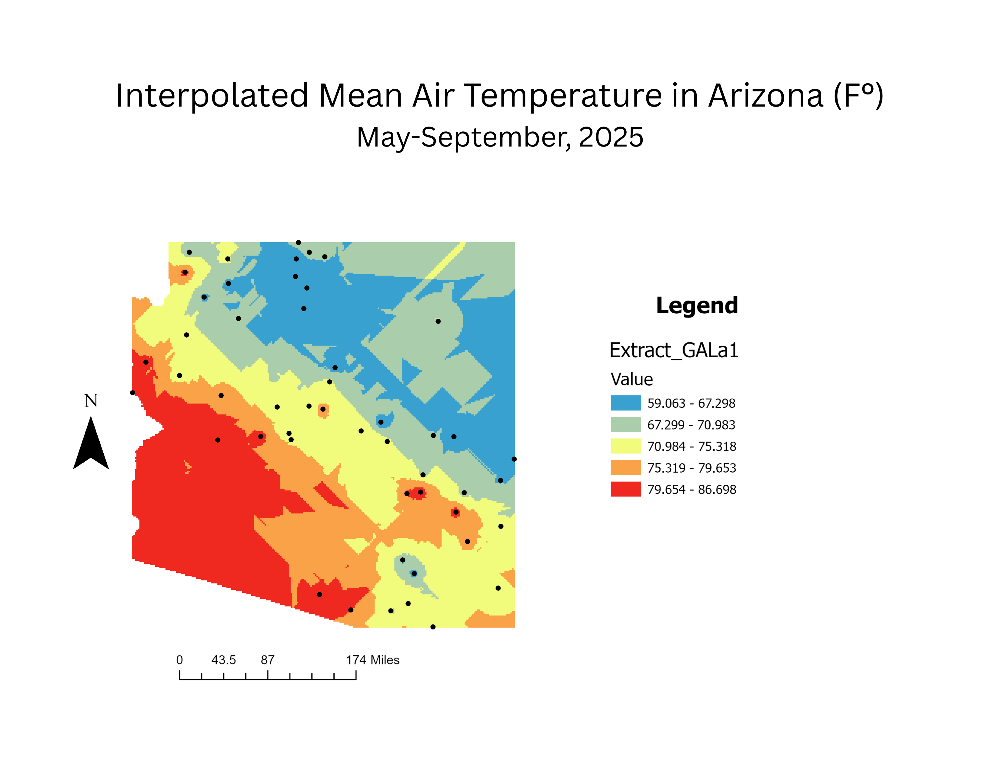

# Interpolated Mean Air Temperature in Arizona (°F)

## May-September, 2025

## Project Overview

This project presents a spatial interpolation of mean air temperatures across Arizona from May through September 2025. The map illustrates regional temperature gradients, highlighting spatial variability driven by elevation, latitude, and localized climatic conditions.

## Data Sources
Point-based air temperature observations from NOAA (May–September 2025).
Geographic boundary data for Arizona.

## Map

Temperature observation points are displayed on the map as reference locations used in the interpolation process.

## Methods
Temperature measurements from monitoring stations were compiled and averaged over the study period.
Ordinary Kriging was applied to generate a continuous temperature surface.
The resulting raster was classified into temperature ranges and symbolized using a graduated color scheme.
Observation points were overlaid to indicate input data locations.

## Key Insights
Northern and higher-elevation regions exhibit lower mean temperatures.
Central Arizona shows moderate temperature ranges, reflecting transitional climatic zones.
Southern and southwestern areas display the highest temperatures, consistent with desert environments.

## Applications
Climate and environmental analysis.
Urban and regional planning.
Heat risk assessment.
Educational and visualization purposes.
